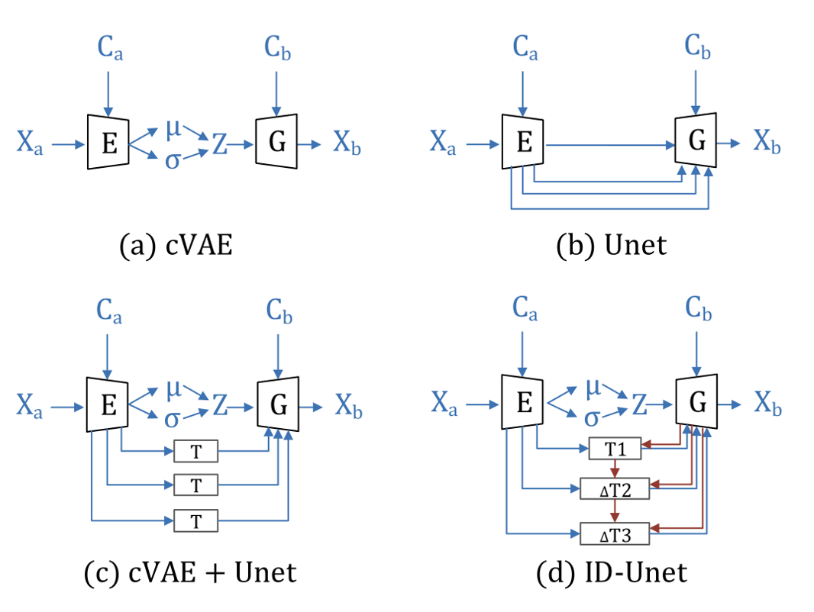
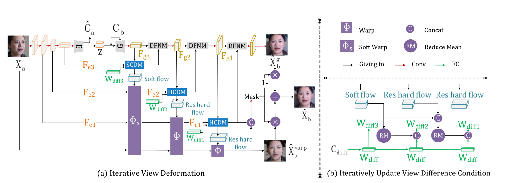
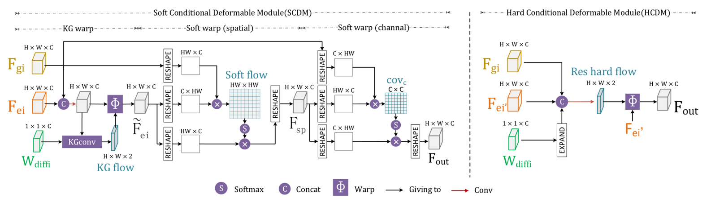
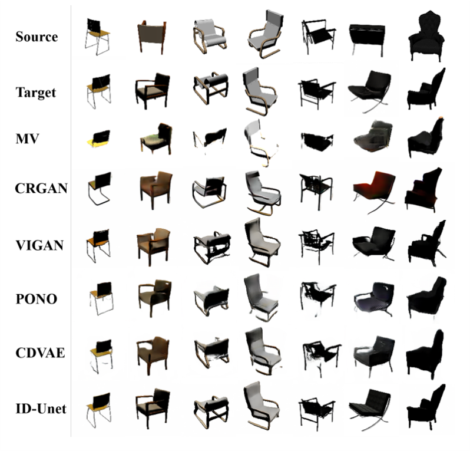
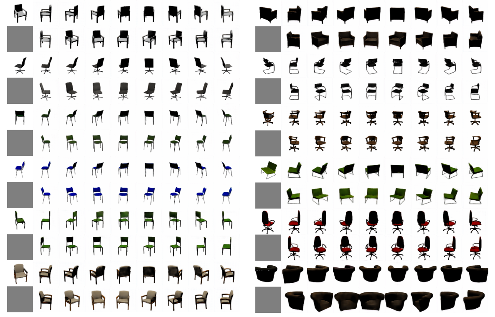
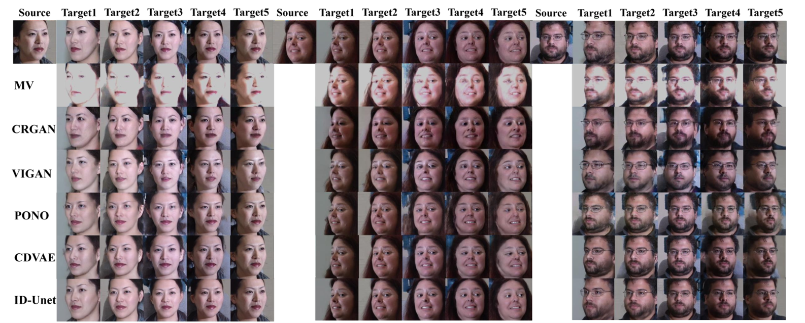
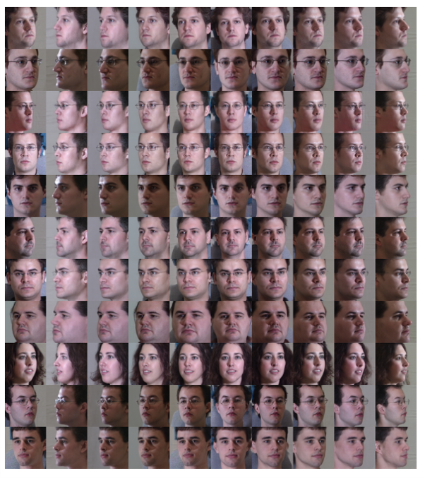
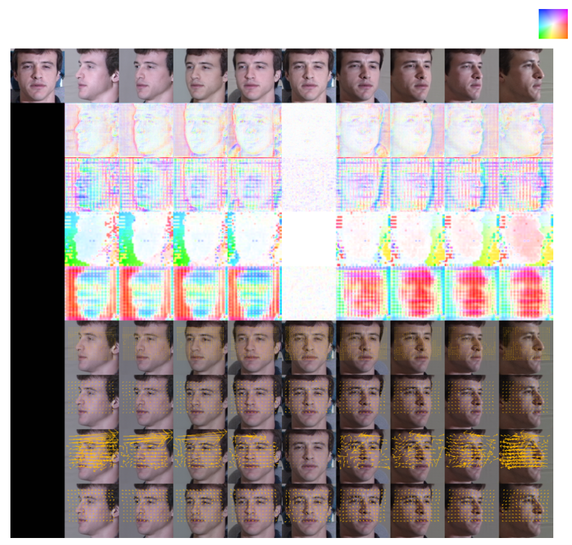

# ID-Unet: Iterative-view-synthesis(CVPR2021 Oral)
Tensorflow implementation of [**ID-Unet: Iterative Soft and Hard Deformation for View Synthesis**](https://arxiv.org/pdf/2103.02264).

**The network architecture**
<p align="center"> <br><center></center></p>
<p align="center"> <br><center></center></p>
<p align="center"> <br><center></center></p>

## Experiment Results
- chair
<p align="center"> <br><center></center></p>
<p align="center"> <br><center></center></p>

- MultiPIE
<p align="center"> <br><center></center></p>
<p align="center"> <br><center></center></p>

- Flow
<p align="center"> <br><center></center></p>


## Preparation

- **Prerequisites**
    - Tensorflow 
    - Python 2.x with matplotlib, numpy and scipy
- **Dataset**
    - [3D chair](https://www.di.ens.fr/willow/research/seeing3Dchairs/data/rendered_chairs.tar) 
    - [MultiPIE](http://www.cs.cmu.edu/afs/cs/project/PIE/MultiPie/Multi-Pie/Home.html)
    - [300w-LP](http://www.cbsr.ia.ac.cn/users/xiangyuzhu/projects/3DDFA/main.htm)
	- Images should be placed in ./datasets/
- **Download model**
    - [Tool model](http://download.tensorflow.org/models/vgg_16_2016_08_28.tar.gz)
        - model should be placed in ./models/
## Quick Start

Exemplar commands are listed here for a quick start.
### dataset
- prepare dataset

    ```console
    python datasets/creat_txt.py --path_MultiPIE 'Path to MultiPIE Dataset' --path_chair 'Path to chair Dataset' --path_300w_LP 'Path to 300w-LP Dataset'
    shuf datasets/multiPIE_train_paired.txt -o  datasets/multiPIE_train_paired_shuf.txt
    python datasets/creat_tf.py --path_MultiPIE 'Path to MultiPIE Dataset' --path_chair 'Path to chair Dataset' --path_300w_LP 'Path to 300w-LP Dataset'

### Training
- To train with size of 128 X 128

    ```console
    python MultiPIE.py --mode training
    
    python chair.py --mode training
    ```

### Testing
- Example of test

    ```console
    python  MultiPIE.py --mode test --batch_size 2 --model_path 'Path to Training Model'
    
    python  chair.py --mode test --batch_size 2 --model_path 'Path to Training Model'
    ```

## Citation
If this work is useful for your research, please consider citing:

@inproceedings{yin2021id,
  title={ID-Unet: Iterative Soft and Hard Deformation for View Synthesis},
  author={Yin, Mingyu and Sun, Li and Li, Qingli},
  booktitle={Proceedings of the IEEE/CVF Conference on Computer Vision and Pattern Recognition},
  pages={7220--7229},
  year={2021}
}


